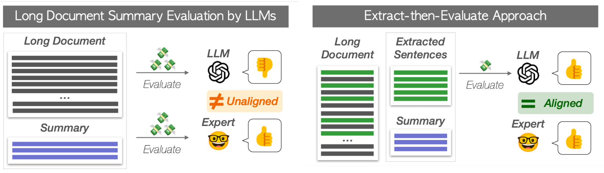
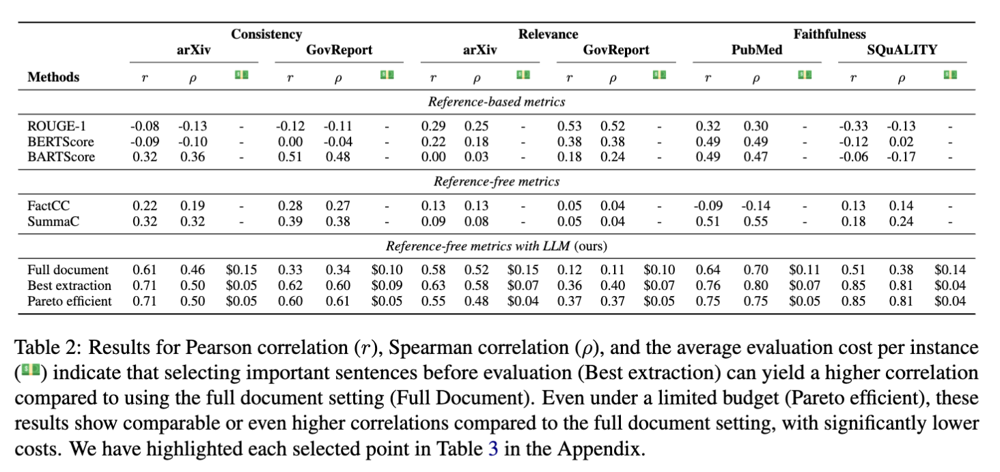
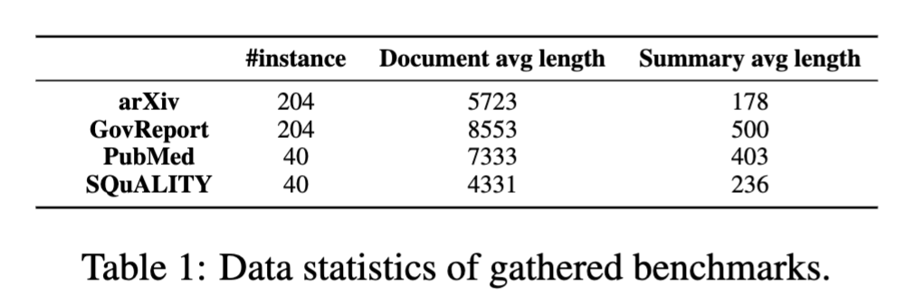

# llm-longeval
[]()
[](https://arxiv.org/abs/2309.07382)

Official repo for paper [Less is More for Long Document Summary Evaluation by LLMs
](https://arxiv.org/abs/2309.07382). 


## Citations
```bibtex
@inproceedings{wu2024long,
      title={{L}ess is {M}ore for {L}ong {D}ocument {S}ummary {E}valuation by {LLM}s}, 
      author={Yunshu Wu\textsuperscript{*} and Hayate Iso\textsuperscript{*} and Pouya Pezeshkpour and Nikita Bhutani and Estevam Hruschka},
      booktitle={Proceedings of the 18th Conference of the European Chapter of the Association for Computational Linguistics},
      year={2024},
      note={\textsuperscript{*}These authors contributed equally to this work.},
}
```

## Brief Abstract
Recent research indicates that Large Language Models (LLMs) can effectively evaluate Natural Language Generation (NLG), but their suitability for evaluating long documents is uncertain due to increased costs and potential quality issues. In this work, we introduce a cost-effective approach that utilizes extraction techniques to create condensed, influential documents, followed by LLMs to evaluate summary quality.

## Baselines Methods
Here we use [G-eval](https://arxiv.org/abs/2303.16634) as our baseline. 

To run G-eval on all benchmarks, use the shell, remember to change the ```--key``` into your openai-key: 
```
./benchmark_run.sh 
```

For arXiv and GovReport, ```--dimension``` should be either ```relevance``` or ```factual_consistency```, and for PubMed and SQuALITY, ```--dimension``` should only be ```faithfulness```.

## Extract-then-Evaluate Method
Our four extraction methods:
- **LEAD**: Extract the first N tokens from the source document (consisting of complete sentences).
- **ROUGE**: Extract sentences from the source document that maximize recall of ROUGE score with the model-generated summary until it reaches N tokens.
- **BERTScore**: Extract sentences as in ROUGE, but use the recall of BERTScore as the criteria.
- **NLI**: Extract sentences that are entailed or contradicted by each sentence in the summary as premises using NLI models until it reaches N tokens. This process aims to extract sentences that are semantically relevant to the summary being evaluated.

Our evaluation method is cheap and of good quality:


## Dataset Stats


## Disclosure 
Embedded in, or bundled with, this product are open source software (OSS) components, datasets and other third party components identified below. The license terms respectively governing the datasets and third-party components continue to govern those portions, and you agree to those license terms, which, when applicable, specifically limit any distribution. You may receive a copy of, distribute and/or modify any open source code for the OSS component under the terms of their respective licenses, which may be BSD 3 clause license and Apache 2.0 license. In the event of conflicts between Megagon Labs, Inc., license conditions and the Open Source Software license conditions, the Open Source Software conditions shall prevail with respect to the Open Source Software portions of the software. 
You agree not to, and are not permitted to, distribute actual datasets used with the OSS components listed below. You agree and are limited to distribute only links to datasets from known sources by listing them in the datasets overview table below. You are permitted to distribute derived datasets of data sets from known sources by including links to original dataset source in the datasets overview table below. You agree that any right to modify datasets originating from parties other than Megagon Labs, Inc. are governed by the respective third party’s license conditions. 
All OSS components and datasets are distributed WITHOUT ANY WARRANTY, without even implied warranty such as for MERCHANTABILITY or FITNESS FOR A PARTICULAR PURPOSE, and without any liability to or claim against any Megagon Labs, Inc. entity other than as explicitly documented in this README document. You agree to cease using any part of the provided materials if you do not agree with the terms or the lack of any warranty herein.
While Megagon Labs, Inc., makes commercially reasonable efforts to ensure that citations in this document are complete and accurate, errors may occur. If you see any error or omission, please help us improve this document by sending information to contact_oss@megagon.ai.